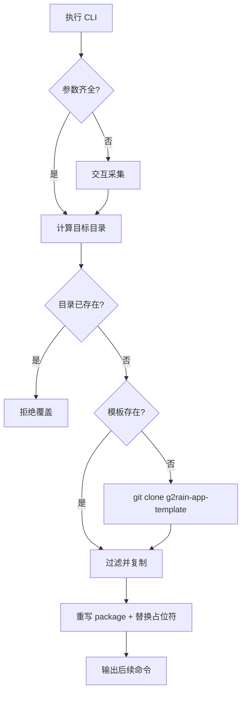

<p align="center">
  
</p>

# g2rain-app-cli

[](LICENSE)
[](https://www.typescriptlang.org/)
[](https://nodejs.org/)

g2rain 官方前端项目创建 CLI。它以 [g2rain-app-template](https://github.com/g2rain/g2rain-app-template) 为模板，交互式或参数式采集项目名与 Context Path，复制模板、排除开发产物、替换占位符并生成新的微前端 App。

CLI 本身是 Node 工具，不直接采用中央 `frontend-app` 运行时分层；它生成的项目必须采用中央 [`frontend-app 1.0.0-draft`](https://github.com/g2rain/g2rain/tree/feature/g2rain-architectur-init/docs/architecture/profiles/frontend-app)。CLI 与模板的中央契约见[项目脚手架规范](https://github.com/g2rain/g2rain/blob/feature/g2rain-architectur-init/docs/architecture/profiles/frontend-app/scaffolding-policy.md)。

[官网](https://www.g2rain.com) · [完整文档](docs/index.md) · [命令接口](docs/development/command-interface.md) · [模板契约](docs/development/template-contract.md) · [Issues](https://github.com/g2rain/g2rain/issues) · [Discussions](https://github.com/g2rain/g2rain/discussions)

## 功能

- 提供 `create-g2rain-app` 和 `g2rain-app` 两个等价命令。
- 支持交互式输入，也支持项目名与 `--context-path` 参数。
- 优先使用 `G2RAIN_TEMPLATE_PATH` 或本地相邻模板；不存在时克隆 GitHub 模板。
- 拒绝覆盖已存在的目标目录。
- 复制时排除 `.git`、`.idea`、`node_modules`、`dist`、`.DS_Store` 和模板 `package-lock.json`，避免继承模板 Git/IDE 状态。
- 重写生成项目的 npm 包名、仓库地址和主页，替换固定文件中的 `{{PROJECT_NAME}}` 与 `{{CONTEXT_PATH}}`。
- 将 `README.md`、`AGENTS.md` 和 `docs/**` 中的模板维护身份转换为业务 App 身份，并记录 CLI 版本、模板仓库与模板 Commit。

CLI 只生成文件，不自动安装依赖、不初始化 Git、不注册 main-shell/平台资源，也不实现生成项目的业务功能。

## 环境

- Node.js `>=22`
- npm
- Git（本地没有模板、需要自动克隆时）

## 安装与运行

从 npm 执行：

```bash
npx create-g2rain-app my-member-app --context-path member
```

安装后使用任一命令：

```bash
create-g2rain-app my-member-app --context-path member
g2rain-app my-member-app --context-path member
```

使用本地模板：

```powershell
$env:G2RAIN_TEMPLATE_PATH = 'D:\github\g2rain-app-template'
npx create-g2rain-app my-member-app --context-path member
```

生成位置是“当前工作目录下的项目名目录”，所以应先 `cd` 到明确的父目录。

## 交互式示例

```text
> npx create-g2rain-app
? Project name › g2rain-new-app
? Context path (URL prefix, without leading slash) › new
➜ Using template: .../g2rain-app-template
✔ Project created at .../g2rain-new-app
  context path: /new
```

Context Path 默认由项目名移除 `g2rain-` 前缀和 `-app` 后缀得到。例如 `g2rain-member-app` 默认生成 `member`。

## 非交互示例

```bash
npx create-g2rain-app g2rain-member-app --context-path member
npx create-g2rain-app g2rain-member-app --context_path member
npx create-g2rain-app g2rain-member-app member
```

当前未知选项会被忽略，项目名和 Context Path 的字符校验也较弱；自动化调用必须只使用已文档化参数，并在生成后检查目录和文件。相关风险见[架构偏差](docs/architecture/deviations.md)。

## 生成流程



详细时序和失败行为见[运行流程](docs/architecture/runtime-flow.md)。

## 生成结果

当前会替换以下文件中的占位符（文件不存在时跳过）：

- `build.sh`
- `lua/config.lua`
- `README.md`
- `.env`
- `.env.production`
- `vite.config.ts`
- `src/runtime/env/index.ts`

此外会重写 `package.json` 的 `name`、`description`、`repository`、`homepage` 和模板关键词，并按明确清单转换 `README.md`、`AGENTS.md`、`docs/project.yaml`、文档入口、架构概览与决策说明中的项目身份。`docs/project.yaml` 会保留 CLI 版本、模板仓库、模板 Commit 和 Context Path，便于追溯生成来源。模板新增占位文件或身份文档时必须同步 CLI 清单和契约测试。

生成后执行：

```bash
cd g2rain-member-app
npm install
npm run build
```

模板 lockfile 当前不会复制，因此首次生成使用 `npm install` 创建自己的 lockfile，而不是直接执行 `npm ci`。

## CLI 开发

```bash
npm ci
npm run build
```

本地验证编译产物：

```bash
npm link
g2rain-app test-app --context-path test
```

`npm run dev` 会直接执行生成流程并在当前工作目录创建项目；不要在含同名重要目录的位置随意运行。推荐使用临时目录和 `G2RAIN_TEMPLATE_PATH` 验证。

当前仓库没有单元测试、lint 或专用 CLI 集成测试脚本，`npm run build` 只执行 TypeScript 编译。测试策略见[测试](docs/development/testing.md)。

## 发布

npm 包名为 `create-g2rain-app`，只发布 `dist`，两个 bin 都指向 `dist/index.js`。发布前必须先构建并检查 tarball：

```bash
npm run build
npm pack --dry-run
```

当前没有 `prepublishOnly` 自动构建，也没有固定模板 Tag；发布者必须确认 dist 与源码一致，并评估模板版本兼容性。详见[发布](docs/operations/publishing.md)。

## 文档

| 主题 | 入口 |
| --- | --- |
| 项目事实与 Agent | [project.yaml](docs/project.yaml) · [AGENTS.md](AGENTS.md) |
| 架构与边界 | [架构概览](docs/architecture/overview.md) · [运行流程](docs/architecture/runtime-flow.md) · [偏差](docs/architecture/deviations.md) |
| 命令与模板 | [命令接口](docs/development/command-interface.md) · [模板契约](docs/development/template-contract.md) |
| 开发与交付 | [本地开发](docs/development/local-development.md) · [测试](docs/development/testing.md) · [发布](docs/operations/publishing.md) |
| 安全 | [安全边界](docs/security/security-boundaries.md) · [漏洞报告](SECURITY.md) |

## 贡献、许可证与联系

使用 `feature/<name>` 或 `fix/<name>` 合并到 `develop`，测试验证后再进入 `main`。CLI 变化会影响以后创建的全部 App，请同步模板契约、测试和文档。

本项目基于 [Apache License 2.0](LICENSE) 开源。

- 官网：[g2rain.com](https://www.g2rain.com)
- Issues：[GitHub Issues](https://github.com/g2rain/g2rain/issues)
- 讨论：[GitHub Discussions](https://github.com/g2rain/g2rain/discussions)
- 邮箱：g2rain_developer@163.com

感谢所有为 g2rain 提交 Issue、代码、文档、建议和使用反馈的开发者。
