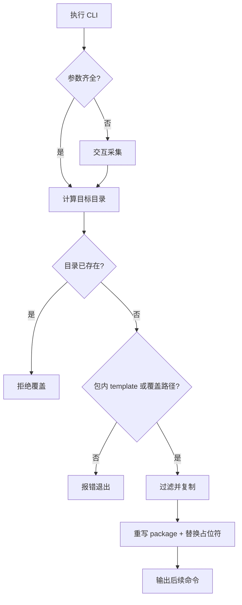

<p align="center">
  
</p>

# g2rain-app-cli

[](LICENSE)
[](https://www.typescriptlang.org/)
[](https://nodejs.org/)

g2rain 官方前端 CLI。支持两个项目族：

- `frontend-app`：内嵌 [g2rain-app-template](https://github.com/g2rain/g2rain-app-template) → 包内 `template/`
- `frontend-shell`：内嵌 [g2rain-shell-template](https://github.com/g2rain/g2rain-shell-template) → 包内 `template-shell/`；可选 `template-shell-legacy/`（`--with-legacy`）

并提供 `generate` / `build-config` 开发期工具（仅业务子应用）。未指定 family 时默认生成 `frontend-app`。

CLI 本身是 Node 工具；生成结果须分别符合中央 [`frontend-app`](https://github.com/g2rain/g2rain/tree/feature/g2rain-architectur-init/docs/architecture/profiles/frontend-app) 与 [`frontend-shell`](https://github.com/g2rain/g2rain/tree/architecture-v1.2.0/docs/architecture/profiles/frontend-shell) Profile。

[官网](https://www.g2rain.com) · [完整文档](docs/index.md) · [使用手册](docs/development/usage.md) · [命令接口](docs/development/command-interface.md) · [模板契约](docs/development/template-contract.md) · [模板快照治理](docs/template-snapshots.md) · [Issues](https://github.com/g2rain/g2rain/issues) · [Discussions](https://github.com/g2rain/g2rain/discussions)

## 功能

- 提供 `create-g2rain-app` 和 `g2rain-app` 两个等价 bin。
- 子命令：`app`、`shell`、`create`（可省略）、`generate`、`build-config`；支持 `--help` / `--version`。
- `app` / 默认 create：包内 `template/`；`G2RAIN_TEMPLATE_PATH` 可覆盖。
- `shell`：包内 `template-shell/`；`G2RAIN_SHELL_TEMPLATE_PATH` 可覆盖；默认 contextPath=`admin`、port=`3000`；可选 `--with-legacy`（merge `template-shell-legacy/`，默认不含）。
- generate / build-config：仅服务 frontend-app 工程。

CLI 不自动安装依赖、不初始化 Git、不注册平台资源。不得用 app 模板冒充 Shell。

## 环境

- Node.js `>=22`
- npm

## 安装与运行

创建业务子应用：

```bash
create-g2rain-app app my-member-app --context-path member
```

创建 Main Shell：

```bash
create-g2rain-app shell my-admin-shell --context-path admin --port 3000
```

创建带存量双协议兼容的 Main Shell（迁移期）：

```bash
create-g2rain-app shell my-admin-shell --context-path admin --port 3000 --with-legacy
```

兼容旧写法（默认 frontend-app）：

```bash
create-g2rain-app my-member-app --context-path member
```

本地开发覆盖模板源仓：

```powershell
$env:G2RAIN_TEMPLATE_PATH = 'D:\github\g2rain-app-template'
$env:G2RAIN_SHELL_TEMPLATE_PATH = 'D:\github\g2rain-shell-template'
```

生成位置是“当前工作目录下的项目名目录”，所以应先 `cd` 到明确的父目录。

## 交互式示例

```text
> npx create-g2rain-app
? Project name › g2rain-new-app
? Context path (URL prefix, without leading slash) › new
➜ Using template: .../create-g2rain-app/template
✔ Project created at .../g2rain-new-app
  context path: /new
```

Context Path 默认由项目名移除 `g2rain-` 前缀和 `-app` 后缀得到。例如 `g2rain-member-app` 默认生成 `member`。

## 非交互示例

```bash
npx create-g2rain-app g2rain-member-app --context-path member
npx create-g2rain-app g2rain-member-app --context_path member
npx create-g2rain-app g2rain-member-app member
```

当前未知选项会报错退出；项目名和 Context Path 的字符校验仍较弱。详见[架构偏差](docs/architecture/deviations.md)与[命令接口](docs/development/command-interface.md)。

### 在已有 App 中使用生成工具

```bash
# App 根目录；需安装 create-g2rain-app 为 devDependency
npm run build:generate -- --tables=member
npm run build:config
# 或直接：
g2rain-app generate --tables=member,member_identity
g2rain-app build-config
```

## 生成流程


```mermaid
flowchart TD
  CLI[执行 CLI] --> Args{参数齐全?}
  Args -->|否| Prompt[交互采集]
  Args -->|是| Target[计算目标目录]
  Prompt --> Target
  Target --> Exists{目录已存在?}
  Exists -->|是| Stop[拒绝覆盖]
  Exists -->|否| Template{包内 template 或覆盖路径?}
  Template -->|否| Fail[报错退出]
  Template -->|是| Copy[过滤并复制]
  Copy --> Replace[重写 package + 替换占位符]
  Replace --> Done[输出后续命令]
```

详细时序和失败行为见[运行流程](docs/architecture/runtime-flow.md)。

## 生成结果

当前会替换以下文件中的占位符（文件不存在时跳过）：

- `build.sh`
- `lua/config.lua`
- `README.md`
- `.env`
- `.env.production`
- `vite.config.ts`
- `src/runtime/env/index.ts`

此外会重写 `package.json` 的 `name`、`description`、`repository`、`homepage` 和模板关键词，并按明确清单转换 `README.md`、`AGENTS.md`、`docs/project.yaml`、文档入口、架构概览与决策说明中的项目身份。`docs/project.yaml` 会保留 CLI 版本、模板仓库、模板 Commit 和 Context Path，便于追溯生成来源。模板新增占位文件或身份文档时必须同步 CLI 清单和契约测试。

生成后执行：

```bash
cd g2rain-member-app
npm install
npm run build
```

模板 lockfile 当前不会复制，因此首次生成使用 `npm install` 创建自己的 lockfile，而不是直接执行 `npm ci`。

## CLI 开发

```bash
npm ci
npm run build
npm run verify:template-snapshots
```

正式刷新包内模板由 GitHub Actions `sync-templates` 完成。本地排障：

```powershell
$env:G2RAIN_ALLOW_LOCAL_SYNC = '1'
$env:G2RAIN_APP_TEMPLATE_REF = 'vX.Y.Z'
$env:G2RAIN_SHELL_TEMPLATE_REF = 'vA.B.C'
# 可选：$env:G2RAIN_TEMPLATE_SOURCE / G2RAIN_SHELL_TEMPLATE_SOURCE
npm run sync:templates
npm run verify:template-snapshots
```

本地验证编译产物：

```bash
npm link
g2rain-app test-app --context-path test
```

`npm run dev` 会直接执行生成流程并在当前工作目录创建项目；不要在含同名重要目录的位置随意运行。推荐使用临时目录验证。

测试：`npm test`。策略见[测试](docs/development/testing.md)。

## 发布

npm 包名为 `create-g2rain-app`，发布 `dist` 与三份内嵌模板快照。正式发布：合并 sync PR → 打 CLI `v*` tag → `publish-npm`（OIDC Trusted Publishing）。本地只运行 `npm pack --dry-run`，不要 `npm publish`。详见[发布](docs/operations/publishing.md)与[模板快照治理](docs/template-snapshots.md)。

## 文档

| 主题 | 入口 |
| --- | --- |
| 项目事实与 Agent | [project.yaml](docs/project.yaml) · [AGENTS.md](AGENTS.md) |
| 架构与边界 | [架构概览](docs/architecture/overview.md) · [运行流程](docs/architecture/runtime-flow.md) · [偏差](docs/architecture/deviations.md) |
| 命令与模板 | [使用手册](docs/development/usage.md) · [命令接口](docs/development/command-interface.md) · [模板契约](docs/development/template-contract.md) · [快照治理](docs/template-snapshots.md) |
| 开发与交付 | [本地开发](docs/development/local-development.md) · [测试](docs/development/testing.md) · [发布](docs/operations/publishing.md) |
| 安全 | [安全边界](docs/security/security-boundaries.md) · [漏洞报告](SECURITY.md) |

## 贡献、许可证与联系

使用 `feature/<name>` 或 `fix/<name>` 合并到 `develop`，测试验证后再进入 `main`。CLI 变化会影响以后创建的全部 App，请同步模板契约、测试和文档。

本项目基于 [Apache License 2.0](LICENSE) 开源。

- 官网：[g2rain.com](https://www.g2rain.com)
- Issues：[GitHub Issues](https://github.com/g2rain/g2rain/issues)
- 讨论：[GitHub Discussions](https://github.com/g2rain/g2rain/discussions)
- 邮箱：g2rain_developer@163.com

感谢所有为 g2rain 提交 Issue、代码、文档、建议和使用反馈的开发者。
