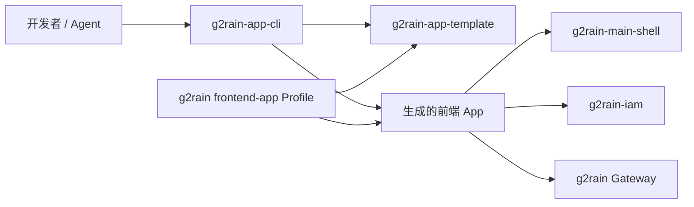

# 架构概览

g2rain-app-cli 是一个单入口 Node.js ESM 命令行工具。它负责把模板转化为新项目，不参与生成项目的浏览器运行时。

## 平台关系

- 中央 `frontend-app` Profile 定义生成项目的跨 App 架构规则。
- app-template 是规则的模板实现和首个试点。
- app-cli 负责选择模板、复制、排除文件、替换占位符和输出下一步命令。
- 生成项目负责自己的业务页面、资源配置、偏差和部署。

## 当前实现

所有 CLI 逻辑当前集中在 `src/index.ts`：

- `parseArgs`：解析项目名和 Context Path。
- `ensureProjectName` / `ensureContextPath`：补齐交互输入。
- `cloneTemplateFromGitHub`：模板不存在时执行 Git clone。
- `copyTemplate`：按过滤规则复制。
- `rewritePackageJson`：重写 npm 包名。
- `replaceTemplatePlaceholders`：替换固定清单中的占位符。
- `main`：协调目标目录保护、生成和结果提示。

单文件对当前规模可接受，但参数、来源、复制、替换和输出已经形成清晰职责。扩展到模板版本、校验、安装或多模板时应拆分模块并补充测试，不继续把所有逻辑堆入 main。

## 核心不变量

- 不覆盖已存在目标目录。
- 生成位置可预测，不能通过项目名逃逸预期父目录。
- 模板来源可追踪且内容可信。
- 排除开发产物、Git 历史和敏感文件。
- 所有模板占位符按契约替换，不遗漏也不误替换用户内容。
- 交互与非交互模式得到相同规范化结果。
- 失败明确非零退出，不把半成品报告为成功。
