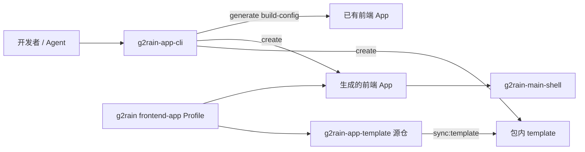

# 架构概览

g2rain-app-cli 是单入口 Node.js ESM 命令行工具（`create-g2rain-app` / `g2rain-app`）。它负责：

1. 把模板脚手架成新业务 App（`create`）
2. 在已有 App 上运行开发期生成工具（`generate`、`build-config`）

不参与生成项目的浏览器运行时。

## 平台关系


```mermaid
flowchart LR
  Developer[开发者 / Agent] --> CLI[g2rain-app-cli]
  Source[g2rain-app-template 源仓] -->|sync:template| Bundled[包内 template]
  CLI -->|create| Bundled
  CLI -->|create| Generated[生成的前端 App]
  CLI -->|generate build-config| ExistingApp[已有前端 App]
  Central[g2rain frontend-app Profile] --> Source
  Central --> Generated
  Generated --> Shell[g2rain-main-shell]
```

## 源码结构

```text
src/
  index.ts              # dispatch
  cli/parse.ts          # 子命令路由
  commands/             # create | generate | build-config
  scaffold/             # 模板复制与身份改写
  tools/generate/       # SQL → 页面引擎 + ejs
  tools/build-config/   # route-map / v-permission → JSON
  types/resource.ts     # 资源 JSON 自包含类型
template/               # 发布用应用模板快照（sync 自源仓）
```

## 核心不变量

- create 不覆盖已存在目标目录。
- 默认模板为包内 `template/` 快照，来源可追溯；排除开发产物与敏感文件。
- generate / build-config 路径相对 `--cwd`，默认对齐 frontend-app 目录约定。
- 未知 CLI 选项失败；失败明确非零退出。
