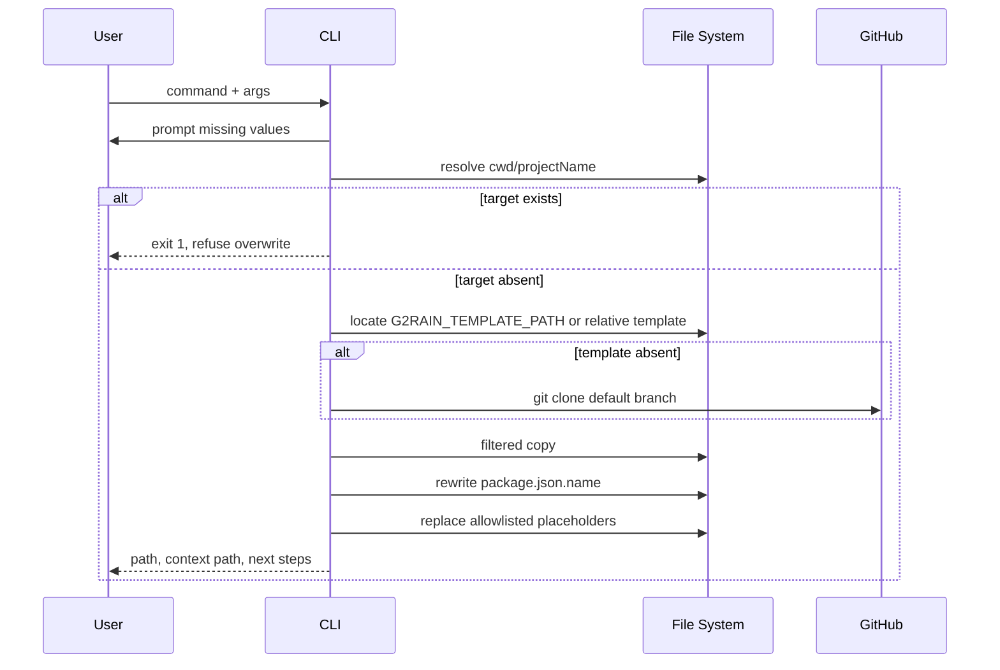

# 运行流程

## 参数解析

```text
argv[2...] → 首个非选项为 projectName
--context-path / --context_path → contextPath
第二个非选项（未设置 contextPath 时）→ contextPath
缺失值 → prompts 交互补齐
```

项目名默认 `g2rain-new-app`。Context Path 默认从项目名移除 `g2rain-` 前缀和 `-app` 后缀，再移除首尾 `/`。

## 生成时序



## 模板定位

1. 若 `G2RAIN_TEMPLATE_PATH` 非空，直接使用该路径。
2. 否则从编译后 `dist` 相对定位 `../../g2rain-app-template`。
3. 路径不存在时，在该位置执行 `git clone https://github.com/g2rain/g2rain-app-template`。

当前只检查路径是否存在，不校验它是否是完整、兼容的模板；clone 也未固定 Tag/Commit。失败可能留下不完整目录，详见[偏差](deviations.md)。

## 复制和替换

复制排除使用 basename，因此任意层级同名的 `.git`、node_modules、dist、package-lock 等都会跳过。复制完成后：

1. 解析并重写目标 `package.json.name`。
2. 并行读取固定文件清单。
3. 文件存在时全量字符串替换两个占位符。
4. 文件不存在时静默跳过。

没有事务目录或回滚。复制后替换失败会留下半成品目标目录，下一次运行又会因目录存在而拒绝继续；使用者需确认后手工删除或移动失败目录。
