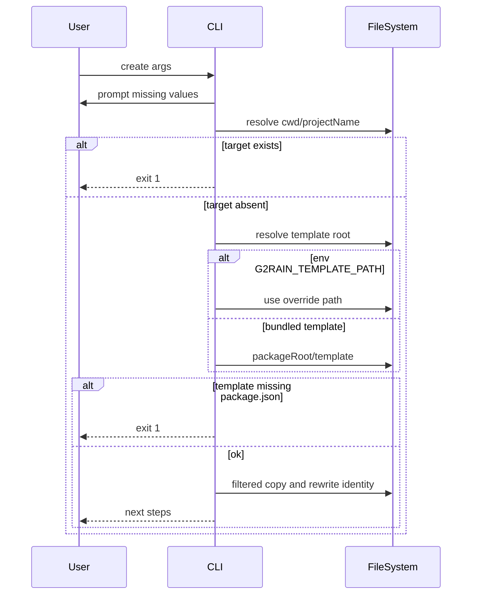

# 运行流程

## 顶层路由

```text
argv[2...] →
  create | generate | build-config → 对应子命令
  其它首 token（非 -）→ 隐式 create
  未知 - 选项 → 报错 exit 1
```

## create

```text
首个非选项为 projectName
--context-path / --context_path → contextPath
第二个非选项（未设置 contextPath 时）→ contextPath
缺失值 → prompts 交互补齐
```


```mermaid
sequenceDiagram
  participant User
  participant CLI
  participant FS as FileSystem

  User->>CLI: create args
  CLI->>User: prompt missing values
  CLI->>FS: resolve cwd/projectName
  alt target exists
    CLI-->>User: exit 1
  else target absent
    CLI->>FS: resolve template root
    alt env G2RAIN_TEMPLATE_PATH
      CLI->>FS: use override path
    else bundled template
      CLI->>FS: packageRoot/template
    end
    alt template missing package.json
      CLI-->>User: exit 1
    else ok
      CLI->>FS: filtered copy and rewrite identity
      CLI-->>User: next steps
    end
  end
```

模板定位：`G2RAIN_TEMPLATE_PATH`（可选覆盖）→ 包内 `template/`。不再默认 Git clone。

## generate / build-config

在 App 根（或 `--cwd`）解析默认相对路径，读写本仓文件；不访问应用模板目录。失败打印原因并 exit 1。
